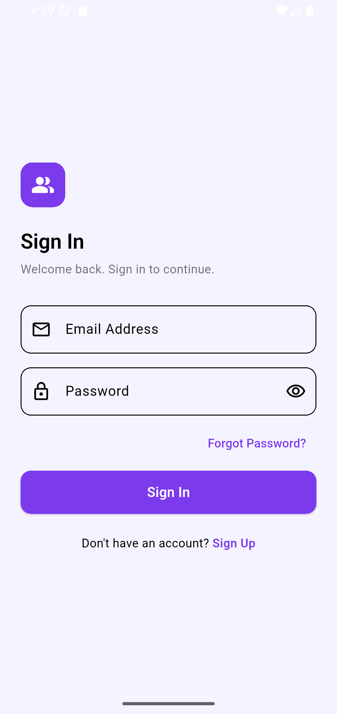
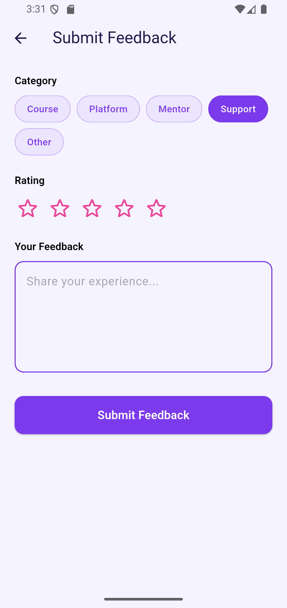
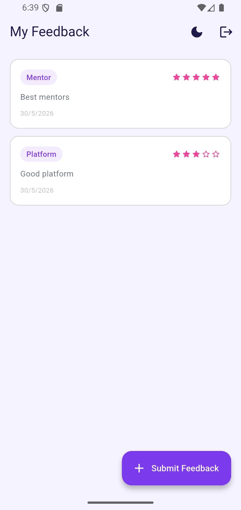
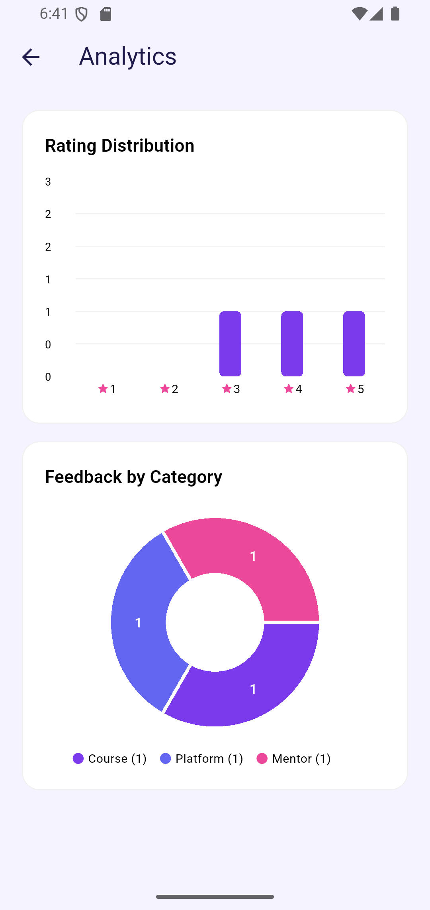

# Feedback & Review App

A Flutter feedback platform for collecting and analyzing reviews from students and companies. Users submit categorized feedback with star ratings, while admins manage submissions and visualize trends through an interactive analytics dashboard.

---

## Features

**User**
- Submit feedback with category selection and star rating
- View personal feedback history in real time

**Admin**
- View and manage all submitted feedback
- Delete individual feedback entries
- Analytics dashboard with rating distribution and category breakdown

**Both**
- Firebase Authentication with email verification
- Real-time data sync via Firestore streams
- Light, Dark and System Default theme support

---

## Tech Stack

| Layer | Technology |
|---|---|
| Framework | Flutter |
| Authentication | Firebase Auth |
| Database | Cloud Firestore |
| State Management | Provider |
| Charts | fl_chart |

---

## Getting Started

```bash
git clone https://github.com/MuhammadYousuf12/feedback-review-app.git
cd feedback-review-app
flutter pub get
flutter run
```

---

## Screenshots

| Login | Feedback Form | Dashboard | Analytics |
|---|---|---|---|
|  |  |  |  |

---

## Author

**Muhammad Yousuf Sorathia**
Flutter Developer | Karachi, Pakistan

[LinkedIn](https://linkedin.com/in/muhammadyousufsorathia) · [GitHub](https://github.com/MuhammadYousuf12)

---

*Part of an active Flutter development portfolio*